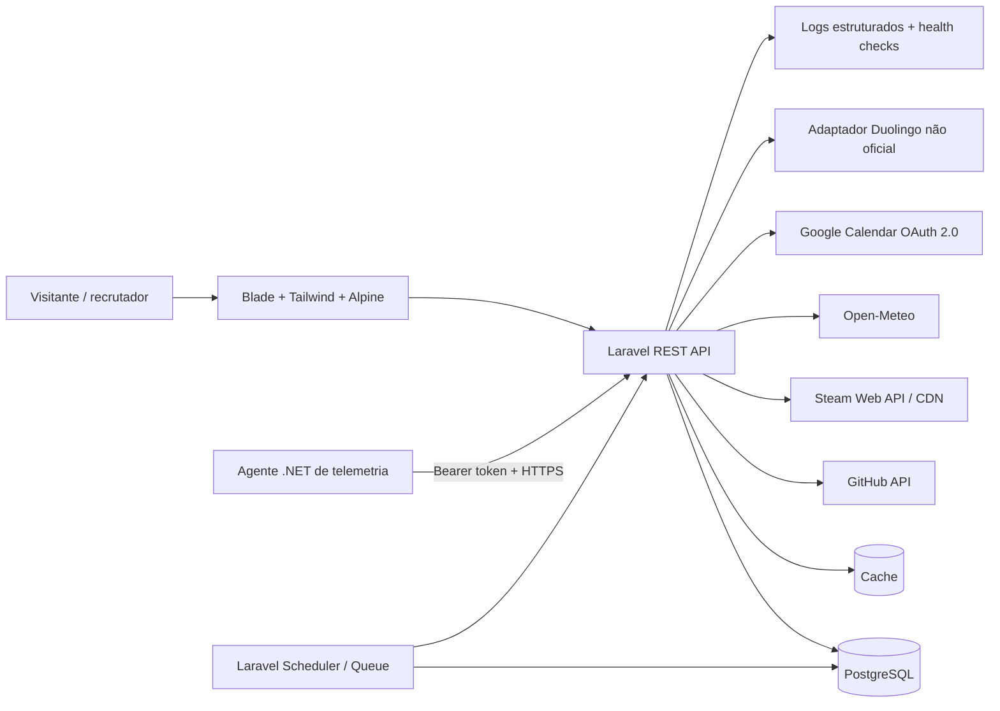

# Roadmap de evolução — Portfólio Pedro Felipe

> Documento vivo de produto e engenharia. Última revisão: 20 de junho de 2026.

## 1. Visão do produto

Transformar o portfólio em uma vitrine técnica confiável, rápida e orientada a recrutadores. A aplicação deve demonstrar, com evidências e não apenas com uma lista de tecnologias, a capacidade de Pedro Felipe para:

- entender regras de negócio e transformar problemas reais em software;
- desenvolver aplicações com Laravel, PHP, JavaScript e bancos relacionais;
- automatizar processos manuais e reduzir retrabalho;
- integrar APIs e sistemas internos com segurança;
- trabalhar entre implantação, desenvolvimento, dados e operação;
- construir recursos observáveis, resilientes e fáceis de manter.

O portfólio terá duas camadas narrativas:

1. **Vitrine profissional:** proposta de valor, experiência, tecnologias, projetos, automações e resultados.
2. **Laboratório técnico:** telemetria, clima, Steam, GitHub, agenda e evolução de estudos.

A vitrine profissional vem primeiro. Integrações enriquecem a demonstração, mas nunca podem esconder o conteúdo principal nem quebrar a página.

## 2. Resultado esperado

Em até 90 segundos, um recrutador deve conseguir responder:

- quem é Pedro e qual problema profissional ele resolve;
- em quais tecnologias possui experiência real;
- quais sistemas, automações e integrações já desenvolveu;
- quais decisões técnicas este projeto demonstra;
- como entrar em contato.

Um desenvolvedor que acessar o repositório deve conseguir compreender:

- a arquitetura e o fluxo de dados;
- os limites entre módulos;
- os contratos das integrações;
- as decisões de segurança e privacidade;
- os critérios de qualidade e os pontos de extensão.

## 3. Princípios de execução

1. **Conteúdo antes de ornamento:** resultados profissionais têm mais peso que efeitos visuais.
2. **Degradação elegante:** nenhuma API externa pode quebrar a página inteira.
3. **Privacidade por padrão:** publicar somente o mínimo necessário.
4. **Dados honestos:** `null`, zero, indisponível e não suportado são estados diferentes.
5. **Arquitetura proporcional:** adicionar complexidade apenas quando houver benefício demonstrável.
6. **Observabilidade desde o início:** falhas devem ser diagnosticáveis sem expor informações sensíveis.
7. **Acessibilidade e mobile como critérios de aceite:** não como acabamento posterior.
8. **Tecnologia comprovada no código:** o README não deve declarar ferramentas que ainda não façam parte da solução.

## 4. Diagnóstico do estado atual

Auditoria revisada no repositório em 21 de junho de 2026.

| Área | Estado atual | Lacuna principal |
|---|---|---|
| Backend | Laravel 13 / PHP 8.3+ | snapshots, histórico e integrações estão persistidos; falta comprovar o deploy de produção |
| Frontend público | Blade, Tailwind CSS 4, Alpine.js 3 e Vite 8 | estados críticos e gráficos históricos estão implementados |
| React/Inertia | React 19 e Inertia 3 na área autenticada | a home pública permanece em Blade por simplicidade operacional |
| Banco principal | PostgreSQL 16 local e PostgreSQL 18 na CI | a migração do volume local exige dump/restore explícitos |
| Telemetria | agente .NET 10/1.3; CPU/GPU, RAM, disco, uptime, controladores e histórico | gate operacional de 24 horas ainda em observação |
| Steam | biblioteca, atividade, conquistas, cache uniforme de 30 minutos e fallback de imagens | falta histórico próprio e atualização por job |
| Clima | Open-Meteo, origem explícita e geolocalização consentida | falta health check agregado das integrações |
| GitHub | integração pública, cache, documentação e teste de resiliência | falta atualização por job e histórico próprio |
| Footer | identidade, contatos condicionais, ano e retorno ao topo | concluído para a Release 1 |
| Conteúdo | resumo, projetos e experiência configuráveis | textos ainda são genéricos e não apresentam resultados concretos das automações |
| Google Calendar | CRUD local, OAuth, sincronização e projeção pública segura | validar credenciais e sincronização no ambiente publicado |
| Duolingo | integração não oficial, feature flag, cache, snapshots e gráfico | observar estabilidade da fonte pública |
| Testes | contratos de integração, autorização, persistência, build e responsividade | ampliar testes visuais automatizados quando houver pipeline de navegador |

### Alerta de segurança P0

Uma chave Steam havia sido preenchida localmente no `.env.example`. Ela foi removida, o histórico auditado não contém a chave e o secret scanning está ativo. Antes de publicar ou divulgar o repositório ainda é obrigatório:

- revogar e rotacionar a chave atual;
- deixar `STEAM_API_KEY=` vazio no arquivo de exemplo;
- verificar o histórico Git e remover a credencial quando necessário;
- executar uma varredura de segredos no repositório e no pipeline;
- nunca registrar tokens, payloads OAuth ou dados pessoais em logs.

## 5. Decisões arquiteturais

### ADR-001 — Manter um monólito modular Laravel

**Decisão recomendada:** evoluir a aplicação pública com Laravel, Blade, Tailwind CSS e Alpine.js, usando Chart.js para gráficos.

**Motivo:** esta é a arquitetura já implementada e suficiente para o produto. Introduzir Next.js agora criaria dois runtimes, duplicaria deploy, autenticação, tratamento de erro e observabilidade sem resolver um problema atual.

React, Next.js e TypeScript só entram após uma ADR própria com caso de uso, custo de operação, estratégia de deploy e benefício mensurável. Até lá, não devem aparecer no README como tecnologias utilizadas na home pública.

### ADR-002 — PostgreSQL como banco-alvo

Adotar PostgreSQL como banco de produção e alinhar os ambientes local, teste e Docker. A troca deve ocorrer antes da criação dos históricos para evitar manter três comportamentos diferentes entre SQLite, MySQL e PostgreSQL.

Gate da migração:

- `docker-compose.yml` usando PostgreSQL;
- `.env.example` sem credenciais reais e com valores seguros de exemplo;
- migrations executando do zero;
- suíte de testes passando no PostgreSQL;
- estratégia de backup e restauração documentada.

### ADR-003 — Integrações atrás de contratos internos

Cada serviço externo terá um cliente, um DTO normalizado, cache, timeout, logs sanitizados e uma resposta de estado consistente. Blade/JavaScript nunca dependerão diretamente do payload bruto do provedor.

### ADR-004 — Jobs para sincronização e snapshots

Coletas que não precisam responder à navegação devem usar jobs e o scheduler do Laravel:

- snapshot e retenção de telemetria;
- sincronização do calendário;
- atualização e snapshot do Duolingo;
- limpeza de caches e dados expirados.

## 6. Arquitetura-alvo



### Fluxo padrão de uma integração

```text
provedor externo -> client -> DTO normalizado -> cache/snapshot -> API -> estado de UI
                              |                    |
                              +-> log sanitizado   +-> último dado válido
```

Quando o provedor falhar, a interface recebe um estado conhecido e, quando seguro, o último dado válido com indicação de defasagem.

## 7. Contrato comum de estados

Todos os cards assíncronos devem trabalhar com o mesmo vocabulário:

| Estado | Significado | Comportamento visual |
|---|---|---|
| `loading` | primeira carga em andamento | skeleton sem números fictícios |
| `available` | dado válido e dentro do prazo | valor, unidade e horário de atualização |
| `stale` | último dado válido expirou | valor opcional com aviso “última atualização...” |
| `unavailable` | integração configurada, mas sem dado | mensagem clara e ação segura quando aplicável |
| `unsupported` | hardware/provedor não oferece a métrica | “Não suportado neste dispositivo” |
| `error` | falha inesperada ou de conexão | mensagem amigável; detalhes somente no log |
| `disabled` | integração não configurada ou desligada | ocultar ou apresentar demonstração sem sugerir erro |

Exemplo de envelope JSON:

```json
{
  "status": "available",
  "data": {},
  "meta": {
    "source": "telemetry-agent",
    "collected_at": "2026-06-20T12:00:00-03:00",
    "stale": false
  },
  "error": null
}
```

Regras obrigatórias:

- zero só é exibido quando for válido para aquela métrica;
- ausência é representada por `null`, nunca por string vazia;
- toda grandeza tem unidade explícita;
- timestamps são armazenados em UTC e apresentados no fuso do usuário;
- erros internos e credenciais nunca chegam ao frontend.

## 8. Modelo de dados proposto

### `telemetry_snapshots`

| Campo | Tipo sugerido | Regra |
|---|---|---|
| `id` | `bigint` | chave primária |
| `cpu_usage` | `decimal(5,2) nullable` | 0–100 |
| `cpu_temperature` | `decimal(5,2) nullable` | `null` quando não suportada |
| `memory_usage` | `decimal(5,2) nullable` | 0–100 |
| `disk_usage` | `decimal(5,2) nullable` | 0–100 |
| `uptime_seconds` | `bigint nullable` | valor numérico, não texto formatado |
| `machine_status` | `varchar(20)` | `online`, `stale` ou `offline` |
| `agent_version` | `varchar(30) nullable` | diagnóstico de compatibilidade |
| `collected_at` | `timestampTz` | momento no agente |
| `received_at` | `timestampTz` | momento no servidor |

Índices: `collected_at`; índice composto `(machine_status, collected_at)` se houver consulta operacional. Não persistir hostname, usuário do Windows, IP público ou identificadores de hardware.

### `duolingo_snapshots`

| Campo | Tipo sugerido | Regra |
|---|---|---|
| `id` | `bigint` | chave primária |
| `username` | `varchar` | valor público configurado |
| `course_key` | `varchar` | identifica idioma/curso |
| `language` | `varchar` | nome normalizado |
| `xp` | `bigint nullable` | XP do curso ou total, documentado |
| `streak` | `integer nullable` | sequência atual |
| `level` | `varchar nullable` | somente se o provedor retornar conceito estável |
| `raw_payload` | `jsonb nullable` | sanitizado, retenção limitada |
| `collected_at` | `timestampTz` | instante do snapshot |

Restrição única sugerida: `(username, course_key, date(collected_at))`, ou chave de data dedicada, garantindo no máximo um snapshot diário por curso.

### `calendar_events_cache`

| Campo | Tipo sugerido | Regra |
|---|---|---|
| `id` | `bigint` | chave primária |
| `provider_event_hash` | `varchar unique` | hash estável; não expor o ID original |
| `display_title` | `varchar` | título permitido ou genérico |
| `type` | `varchar` | reunião, tarefa, estudo, entrega ou projeto |
| `start_at` | `timestampTz` | início |
| `end_at` | `timestampTz` | fim |
| `visibility` | `varchar` | `public`, `busy` ou `hidden` |
| `status` | `varchar` | confirmado, provisório ou cancelado |
| `source` | `varchar` | calendário normalizado |
| `synced_at` | `timestampTz` | última sincronização |
| timestamps | Laravel | auditoria do cache |

Não persistir o título original de um evento privado para depois mascará-lo. O dado sensível deve ser descartado na borda da integração.

### Tabelas auxiliares recomendadas

- `integration_health`: integração, último sucesso, última falha, latência e estado;
- `oauth_connections`: tokens Google criptografados, escopos e expiração, acessível apenas no backend;
- tabela de `jobs`/`failed_jobs` do Laravel para sincronizações assíncronas.

## 9. Roadmap por releases

As estimativas são relativas: **S** (pequena), **M** (média), **L** (grande). Cada release só avança após cumprir seu gate.

### Release 0 — Segurança e linha de base (P0, S)

**Objetivo:** tornar seguro continuar desenvolvendo e publicar o repositório.

Entregas:

- [ ] rotacionar a chave Steam exposta; o `.env.example` já está limpo;
- [x] verificar histórico Git e executar secret scanning;
- [x] documentar variáveis por nome, finalidade e obrigatoriedade, nunca por valor real;
- [x] adicionar timeouts, retries limitados e logs sanitizados aos clientes externos;
- [x] registrar baseline de testes, Lighthouse e responsividade;
- [x] decidir e registrar a migração para PostgreSQL;
- [x] remover artefatos compilados e diretórios gerados do versionamento quando aplicável (`bin`, `obj`, builds locais).

Critérios de aceite:

- nenhuma credencial detectada no repositório;
- `.env.example` inicializa o projeto sem conter segredos;
- testes existentes passam;
- falha de qualquer integração externa não derruba `GET /`;
- o README diferencia claramente recursos implementados e planejados.

### Release 1 — Vitrine estável (P0/P1, M)

**Status:** concluída em 20 de junho de 2026. Evidências: testes automatizados, matriz responsiva, [baseline de qualidade](docs/performance-baseline.md) e captura no README.

#### 1.1 Footer

- centralizar e organizar nome, cargo, LinkedIn, GitHub, e-mail e ano atual;
- esconder canais não configurados sem deixar espaços vazios;
- manter foco visível, área de toque mínima e `rel="noopener noreferrer"` em links externos;
- revisar layout em 320, 375, 768 e 1440 px.

**Aceite:** sem overflow horizontal, links navegáveis por teclado e conteúdo centralizado em desktop e mobile.

#### 1.2 Imagens da Steam

- criar partial/componente reutilizável para imagem de jogo;
- tentar `header` e depois `capsule` quando a primeira fonte falhar;
- usar fallback local com gradiente, ícone e nome do jogo;
- reservar proporção e dimensões antes do carregamento para evitar layout shift;
- usar `loading="lazy"`, dimensões explícitas e `object-fit: cover`;
- validar resposta HTTP no backend apenas quando o custo justificar, com cache; o evento de erro da imagem continua sendo a defesa final no navegador.

**Aceite:** URL inexistente, timeout ou imagem vazia nunca exibem ícone quebrado nem alteram a altura do card.

#### 1.3 Clima e localização

- exibir origem explícita: “Clima em Natal/RN” ou “Clima baseado na sua localização aproximada”;
- tratar separadamente localização fixa, aproximada por IP e coordenada autorizada pelo navegador;
- solicitar geolocalização apenas após ação/consentimento do visitante;
- ao negar ou expirar a permissão, usar Natal/RN e explicar o fallback sem insistir;
- não persistir coordenadas do visitante nem enviá-las a logs;
- distinguir falha de localização de falha do serviço meteorológico.

**Aceite:** todos os caminhos — permitido, negado, timeout, IP privado e API indisponível — produzem um card compreensível e sem dados falsos.

#### 1.4 Telemetria indisponível

- implementar o contrato comum de estados;
- mostrar exatamente “Telemetria indisponível no momento.” quando não houver amostra válida;
- mostrar `unsupported` por métrica, sem transformar `null` em zero;
- exibir horário da última leitura e indicador de defasagem;
- limpar o `setInterval` ao desmontar/abandonar a página e evitar requisições concorrentes.

**Aceite:** testes cobrem dado válido, zero válido, `null`, cache vazio, amostra antiga, resposta 500 e timeout.

**Gate da Release 1:** home útil mesmo com Steam, clima e telemetria simultaneamente indisponíveis.

**Gate:** aprovado pelo teste `HomeResilienceTest`; os estados de erro, timeout, cache vazio, `null`, zero e amostra defasada também possuem cobertura automatizada.

### Release 2 — Telemetria histórica (P1, L)

**Status técnico:** implementada em 20 de junho de 2026. PostgreSQL, snapshots idempotentes, agregação, retenção, histórico, gráfico com lacunas e testes SQLite/PostgreSQL estão ativos. **Gate operacional pendente:** completar 24 horas contínuas de coleta real e confirmar a execução horária do scheduler em produção.

#### 2.1 Coleta

Expandir o agente .NET para enviar:

- uso de CPU;
- uso de RAM;
- temperatura da CPU quando suportada;
- uso do disco principal;
- uptime em segundos;
- versão do agente e instante da coleta.

O status da máquina é derivado no servidor pela idade da última amostra, não enviado como verdade pelo agente.

#### 2.2 Ingestão e persistência

- validar faixa, tipo e timestamp de cada métrica;
- aplicar rate limit por token e proteção contra payload excessivo;
- armazenar snapshot e atualizar o cache da última leitura;
- tornar a ingestão idempotente por agente + instante de coleta;
- definir retenção: dados brutos por 7 dias e agregados por hora por 90 dias, ajustável por configuração;
- executar limpeza por scheduler.

#### 2.3 API de histórico

Contrato sugerido:

```text
GET /api/telemetry/latest
GET /api/telemetry/history?metric=cpu_usage&range=6h&resolution=5m
GET /api/health/integrations
```

- permitir apenas métricas e intervalos predefinidos;
- limitar quantidade de pontos;
- devolver timestamps UTC, unidade e estado de suporte;
- usar agregação por janela para não enviar milhares de amostras.

#### 2.4 Visualização

- transformar cada métrica em card clicável e acessível;
- abrir modal com título, unidade, período e gráfico de linha;
- filtros: 1h, 6h, 12h e 24h;
- indicar lacunas sem interpolar dados inexistentes;
- incluir resumo mínimo/máximo/média quando fizer sentido;
- oferecer tabela textual resumida ou descrição para acessibilidade.

**Aceite:** histórico continua correto com métricas parcialmente suportadas, mudança de fuso, lacunas e mais de 24 horas de dados; consultas críticas têm teste de performance e não fazem N+1.

**Gate da Release 2:** 24 horas de coleta estável, retenção automática comprovada e gráfico sem dados inventados.

### Release 3 — Narrativa profissional (P1, M)

#### 3.1 Hero e “Sobre mim”

Texto-base sugerido:

> Sou desenvolvedor Full Stack com experiência em Laravel, PHP, JavaScript e bancos relacionais. Atuo entre desenvolvimento e implantação, transformando regras de negócio em sistemas internos, integrações e automações que reduzem trabalho manual e tornam a operação mais confiável. Minha experiência inclui APIs, geração de documentos, scripts SQL, dashboards e evolução de soluções como o NAVI.

O texto final deve ser validado contra o histórico real e o LinkedIn. Não publicar números, cargos, clientes ou resultados não confirmados.

#### 3.2 Tecnologias

Organizar por competência, não como nuvem de badges:

- **Backend:** Laravel, PHP, REST APIs;
- **Frontend:** JavaScript, Blade, Tailwind CSS;
- **Dados:** PostgreSQL, MySQL, SQL, Power BI;
- **Infraestrutura:** Docker, Git, GitLab e CI/CD quando comprovado;
- **Integrações:** Google APIs, Steam, clima e APIs corporativas;
- **Automação:** geração de documentos, rotinas operacionais e scripts de dados.

Cada grupo deve apontar para projeto, automação ou contexto que comprove seu uso.

#### 3.3 Projetos reais

Usar cards no formato **contexto → ação → tecnologia → resultado**:

- NAVI Dashboard;
- sistemas e fluxos de implantação;
- integrações e geração automática de documentos;
- soluções de Tributos, VISA, Meio Ambiente, CPA, Saneamento, Mantis e Monitoramento.

Quando houver confidencialidade, descrever domínio, decisão técnica e impacto sem revelar código, dados, endpoints, nomes internos sensíveis ou arquitetura protegida.

#### 3.4 Automações desenvolvidas

Para cada automação, registrar:

- processo manual anterior;
- problema e regra de negócio;
- solução criada;
- stack e integrações;
- ganho qualitativo ou quantitativo confirmado;
- responsabilidade direta de Pedro.

#### 3.5 Dados e integrações

Demonstrar experiência com modelagem, consultas SQL, PostgreSQL/MySQL, Power BI, validação de payloads, idempotência, cache, observabilidade e tratamento de falhas.

**Aceite:** toda afirmação relevante possui evidência verificável; linguagem é clara para recrutadores e tecnicamente interessante para desenvolvedores; nenhuma informação confidencial é exposta.

**Gate da Release 3:** revisão final do conteúdo por Pedro e links sociais reais configurados.

**Status em 21 de junho de 2026:** estrutura implementada com competências ligadas a evidências, três projetos no formato contexto–ação–resultado, três automações documentadas e GitHub/LinkedIn reais configurados. O conteúdo profissional foi revisado a partir do PDF do LinkedIn e mantido no código, sem importador administrativo.

### Release 4 — Google Calendar com privacidade (P2, L)

#### 4.1 OAuth e acesso mínimo

- implementar OAuth 2.0 no backend;
- solicitar o menor escopo compatível, preferindo disponibilidade/freebusy;
- armazenar refresh token criptografado no servidor;
- limitar conexão e callback a usuário administrativo autenticado;
- incluir revogação da conexão;
- documentar redirect URIs, expiração e rotação sem registrar tokens.

#### 4.2 Projeção segura

Definir allowlist de calendários/eventos publicáveis. O frontend recebe somente:

- título aprovado ou genérico (“Compromisso”);
- data e intervalo de horário;
- tipo de atividade;
- status normalizado.

Eventos privados nunca terão descrição, participantes, sala, link de reunião ou título original persistidos/expostos.

#### 4.3 Sincronização e Gantt

- sincronizar por job e servir dados do cache local;
- próximos 7 dias como única visualização em tabela, mantendo dias vazios;
- linha simples para um compromisso e Gantt para múltiplos no mesmo dia;
- título e horário como únicos dados visuais do compromisso;
- não carregar a agenda diretamente durante o request da home.

**Aceite:** testes comprovam que evento privado vira somente bloco ocupado; token revogado degrada para estado indisponível; Gantt é navegável por teclado e legível no mobile.

Documentação de referência:

- [Google Calendar API — Freebusy: query](https://developers.google.com/workspace/calendar/api/v3/reference/freebusy/query)
- [Google Calendar API — Choose scopes](https://developers.google.com/workspace/calendar/api/auth)
- [Google OAuth 2.0 para aplicações web](https://developers.google.com/identity/protocols/oauth2/web-server)

**Gate da Release 4:** revisão manual de privacidade com calendário contendo eventos públicos, privados, cancelados e recorrentes.

**Status em 21 de junho de 2026:** implementado OAuth administrativo com state, refresh token criptografado, escopo FreeBusy por padrão, allowlist opcional de títulos, projeção segura, job a cada 15 minutos, revogação e tabela dos próximos sete dias, inclusive vazios. Um compromisso aparece em linha simples; múltiplos no mesmo dia usam Gantt. Filtros e resumo mensal foram removidos. A conta administrativa está conectada e a sincronização real segue saudável. O gate final ainda requer a matriz manual com eventos públicos, privados, cancelados e recorrentes.

### Release 5 — Duolingo experimental (P2, M/L)

Esta integração depende de endpoints não oficiais e deve permanecer isolada, opcional e protegida por feature flag.

#### 5.1 Adaptador

- criar `DuolingoClient` atrás de uma interface própria;
- nunca chamar o provedor no frontend;
- usar somente dados públicos do perfil quando possível;
- aplicar timeout curto, cache, retry limitado e circuit breaker simples;
- não armazenar senha ou sessão em texto puro;
- permitir desativação sem alterar a página.

#### 5.2 Cache e histórico

- atualizar em intervalo configurável, inicialmente a cada 6 horas;
- salvar no máximo um snapshot diário por curso;
- normalizar idioma, XP e streak;
- limitar e sanitizar `raw_payload` ou removê-lo se não tiver valor de diagnóstico;
- manter o último snapshot válido identificado como defasado quando o provedor falhar.

#### 5.3 Interface

- cards de idioma, XP total e streak;
- gráfico de evolução somente após existirem pontos históricos suficientes;
- mensagem transparente quando a fonte estiver indisponível;
- aviso discreto de que a integração usa fonte não oficial.

**Aceite:** mudanças no payload externo não causam erro 500 na home; fixtures cobrem campos ausentes; feature flag desliga rota, job e interface.

**Gate da Release 5:** sete dias de snapshots consistentes e nenhuma credencial privada necessária para manter o recurso.

**Status em 20 de junho de 2026:** implementado adaptador isolado, normalização defensiva, timeout/retry/circuit breaker, upsert diário por curso, job a cada 6 horas, cards, gráfico e tabela acessível. O perfil público `Pedro_Felipe_Brt` foi conectado e o primeiro snapshot real registrou Inglês, 2.911 XP e sequência de 47 dias. O gate operacional de sete dias começou nesta data.

### Release 6 — Documentação, qualidade e entrega (P1 contínuo, M)

#### README principal

O README deve priorizar apresentação técnica, contendo:

1. visão geral e proposta de valor;
2. captura de tela ou demonstração curta;
3. arquitetura e fluxo de dados;
4. tecnologias realmente utilizadas;
5. módulos e funcionalidades;
6. decisões técnicas e ADRs;
7. segurança e privacidade;
8. observabilidade e resiliência;
9. estratégia de testes e qualidade;
10. roadmap resumido e status das integrações.

Instruções extensas de instalação ficam em `docs/development.md`, não no centro da narrativa do README.

#### Documentação por módulo

Criar:

```text
docs/
├── architecture.md
├── development.md
├── security.md
├── adr/
│   ├── 001-modular-monolith.md
│   ├── 002-postgresql.md
│   └── 003-integration-contracts.md
└── modules/
    ├── portfolio.md
    ├── telemetry.md
    ├── steam.md
    ├── weather.md
    ├── github.md
    ├── calendar.md
    ├── duolingo.md
    └── api.md
```

Cada módulo documenta objetivo, responsabilidades, fluxo, dependências, contrato de dados, cache, estados de erro, segurança, testes e pontos de extensão.

#### Qualidade automatizada

- PHP: Pest/PHPUnit, Laravel Pint e análise estática;
- JavaScript/CSS: lint/format e build de produção;
- integração: contratos com `Http::fake()`, timeouts e payloads incompletos;
- interface: viewport mobile/desktop, teclado, contraste e redução de movimento;
- segurança: secret scanning e auditoria de dependências;
- CI: instalar, migrar PostgreSQL, testar e gerar build em todo pull request.

**Aceite:** documentação corresponde ao código, links não estão quebrados e o pipeline parte de ambiente limpo.

## 10. Backlog priorizado

### P0 — Antes de publicar

- [ ] rotacionar e remover a chave Steam exposta;
- [x] impedir vazamento de segredos em arquivos e logs;
- [x] garantir que a home sobreviva à falha de todas as integrações;
- [x] tratar telemetria ausente sem zeros falsos;
- [x] corrigir imagens quebradas da Steam;
- [x] configurar contatos reais ou esconder canais vazios.

### P1 — Valor direto para recrutadores

- [x] reescrever narrativa profissional com afirmações comprováveis;
- [x] apresentar projetos e automações com impacto qualitativo;
- [x] melhorar footer e responsividade;
- [x] explicitar localização do clima;
- [x] persistir e visualizar telemetria;
- [x] produzir README arquitetural e CI.

### P2 — Diferenciação técnica

- [ ] Google Calendar seguro + Gantt;
- [ ] Duolingo experimental + histórico;
- [x] health dashboard interno das integrações;
- [x] agregação e retenção avançada de séries temporais.

### P3 — Futuro, fora do MVP

- LeetCode;
- GitHub Contributions detalhadas;
- dashboard de estudos e certificações;
- métricas de produtividade com consentimento;
- análise de perfil profissional assistida por IA;
- migração para Next.js somente se uma ADR demonstrar necessidade.

## 11. Critérios globais de qualidade

### Performance

- LCP abaixo de 2,5 s no cenário móvel de referência;
- CLS abaixo de 0,1;
- imagens com dimensões reservadas e lazy loading fora da primeira dobra;
- home não bloqueada por chamadas a terceiros;
- queries históricas limitadas e agregadas.

### Acessibilidade

- navegação completa por teclado;
- foco visível e ordem lógica;
- contraste WCAG AA;
- labels acessíveis para cards clicáveis, modal e filtros;
- respeito a `prefers-reduced-motion`;
- gráficos acompanhados por resumo textual.

### Segurança e privacidade

- HTTPS em produção;
- OAuth no backend e escopos mínimos;
- tokens criptografados e nunca enviados ao browser;
- rate limit em ingestão e endpoints públicos custosos;
- validação por allowlist;
- logs sem tokens, coordenadas, payloads pessoais ou detalhes de eventos;
- política explícita de retenção e exclusão.

### Resiliência

- timeout em toda chamada externa;
- retry apenas para falhas transitórias e com limite;
- cache com indicação de defasagem;
- falhas isoladas por integração;
- estados vazios úteis e nenhuma exceção exposta ao visitante.

### Testes mínimos por módulo

- caminho feliz;
- integração desabilitada;
- timeout e erro HTTP;
- payload incompleto ou alterado;
- cache válido e expirado;
- autorização/privacidade quando aplicável;
- visualização mobile e desktop.

## 12. Observabilidade

Logs estruturados devem incluir `integration`, `operation`, `status`, `duration_ms` e um `correlation_id`, mas nunca segredos ou dados pessoais.

Indicadores mínimos:

- horário do último sucesso por integração;
- taxa de erro por provedor;
- latência externa;
- idade do último snapshot;
- tamanho da fila e jobs com falha;
- versão ativa do agente de telemetria.

Disponibilizar health check detalhado apenas para área autenticada. O endpoint público deve revelar somente `ok` ou `degraded`, sem configuração interna.

## 13. Riscos e respostas

| Risco | Impacto | Resposta |
|---|---|---|
| endpoint do Duolingo mudar | card e snapshots param | adaptador isolado, fixtures, feature flag e último snapshot válido |
| sensor de temperatura não existir | métrica ausente | estado `unsupported`, diagnóstico `--list-sensors`, sem zero falso |
| limite ou indisponibilidade de API | lentidão/erro | cache, timeout, job assíncrono e degradação elegante |
| calendário vazar dado pessoal | impacto crítico | freebusy, projeção na borda, allowlist e testes de privacidade |
| três bancos diferentes | bugs entre ambientes | padronização em PostgreSQL antes dos históricos |
| excesso de frameworks | manutenção e deploy mais caros | monólito modular e ADR antes de nova stack |
| narrativa expor informação corporativa | risco profissional | revisão manual e anonimização por domínio/resultado |
| séries temporais crescerem sem limite | custo e lentidão | retenção, agregação, índices e limites de consulta |

## 14. Definition of Done

Uma tarefa só está concluída quando:

- comportamento e critérios de aceite estão implementados;
- estados de loading, vazio, erro, indisponível e não suportado foram considerados;
- testes proporcionais ao risco passam;
- layout foi verificado em mobile e desktop;
- acessibilidade por teclado foi conferida;
- logs e tratamento de erro não vazam dados;
- documentação do módulo foi atualizada;
- não há segredo, arquivo gerado ou debug acidental no diff;
- build de produção e pipeline estão verdes.

## 15. Ordem recomendada de execução

```text
R0 Segurança
  ↓
R1 Vitrine estável
  ├── footer
  ├── Steam resiliente
  ├── clima explícito
  └── estados da telemetria
  ↓
R2 PostgreSQL + telemetria histórica
  ↓
R3 narrativa profissional
  ↓
R4 Google Calendar + privacidade
  ↓
R5 Duolingo experimental
  ↓
R6 documentação e qualidade contínuas
```

Primeira entrega recomendada: concluir **R0 + R1**. Ela reduz risco, melhora imediatamente a percepção do portfólio e cria a base de resiliência que as integrações seguintes reutilizarão.
