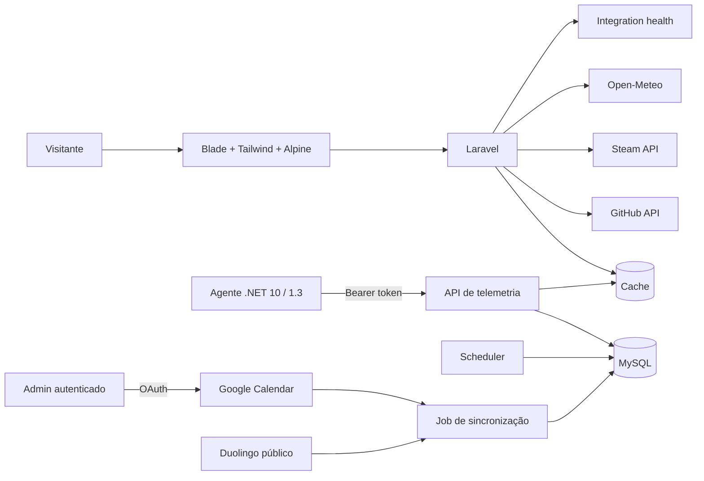

# Arquitetura

## Contexto

A home pública usa Laravel, Blade, Tailwind CSS, Alpine.js e Chart.js carregado apenas quando um histórico é aberto. React/Inertia permanece restrito às páginas autenticadas.

## Fluxo atual

Chamadas externas não ficam no caminho crítico da home: a página lê snapshots locais e agenda atualização após a resposta. Cada integração normaliza o payload, aplica cache/timeout/retry e registra apenas estado e latência sanitizados.

## Limites

- `App\Services\GitHub`: dados públicos e cache do GitHub;
- `App\Services\Steam`: biblioteca, presença e conquistas;
- `App\Services\Weather`: previsão e origem da localização;
- `App\Services\Telemetry`: ingestão, histórico, retenção e saúde;
- `App\Services\Calendar`: OAuth, FreeBusy/eventos, projeção privada e dashboard semanal;
- `App\Services\Duolingo`: adaptador não oficial, snapshots e circuit breaker;
- `App\Services\Professional`: projeção do conteúdo profissional revisado em configuração;
- `TelemetryController`: contrato HTTP público e ingestão autenticada;
- `config/portfolio.php`: conteúdo público editável;
- `tools/telemetry-agent`: coletor Windows independente.

MySQL é o banco principal. O ambiente local usa MySQL 8.4 na porta `3308`, com volume Docker persistente. SQLite continua suportado apenas para testes rápidos de portabilidade.
