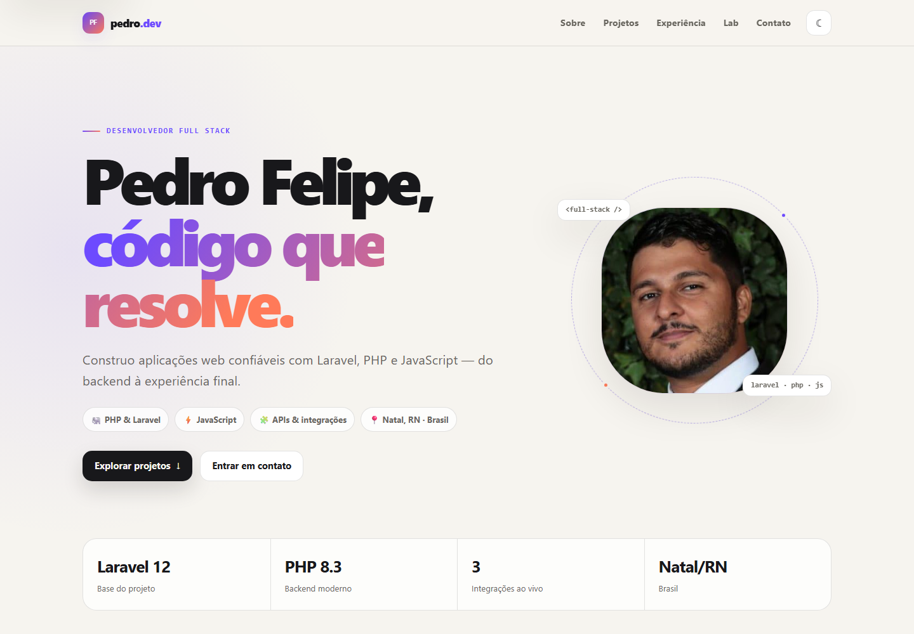

# Portfólio técnico — Pedro Felipe

Portfólio em Laravel 13 que combina uma vitrine profissional com um laboratório de integrações reais. O projeto demonstra Blade/Tailwind, APIs externas resilientes, cache, testes, segurança por token e um agente Windows de telemetria.



## Módulos implementados

| Módulo | Estado | Responsabilidade |
|---|---|---|
| Vitrine | disponível | perfil, projetos, experiência, contatos e tema claro/escuro |
| GitHub | disponível | perfil, repositórios e atividade pública com cache |
| Clima | disponível | Open-Meteo, fallback Natal/RN e geolocalização somente por consentimento |
| Steam | opcional | biblioteca, jogos recentes e conquistas; depende de credenciais privadas |
| Telemetria | disponível | agente .NET 10/1.3 com inicialização automática, CPU/GPU/RAM/disco/uptime, PostgreSQL, histórico e retenção |
| Google Agenda | leitura e escrita opcionais | CRUD local, OAuth, allowlist, snapshot e agenda semanal |
| Login Google | disponível | OpenID, e-mail verificado, state e vínculo seguro de conta |
| Duolingo | disponível | perfil `Pedro_Felipe_Brt`, snapshots diários, histórico e circuit breaker |
| Perfil profissional | conteúdo revisado | experiências e formação validadas a partir do PDF do LinkedIn |

Falhas externas são isoladas: GitHub, Steam, clima e telemetria podem ficar indisponíveis simultaneamente sem derrubar a home.

## Arquitetura

```text
Blade + Tailwind 4 + Alpine 3
          |
       Laravel
       /  |  \
  clients cache API autenticada <--- agente .NET Windows
             |
        PostgreSQL + histórico
   /  |  \
GitHub Steam Open-Meteo Google Duolingo
```

O projeto permanece um monólito modular Laravel. PostgreSQL 16 persiste snapshots e agregados de telemetria; Chart.js é carregado sob demanda para os gráficos. O banco permanece nessa versão até uma migração explícita do volume, enquanto o CI também valida PostgreSQL 18. Veja [arquitetura](docs/architecture.md) e [ADRs](docs/adr/).

## Segurança e privacidade

- segredos ficam somente no `.env` e são verificados por `npm run test:secrets`;
- o agente usa Bearer token, identificador aleatório e não publica hostname, usuário, IP ou identificadores de hardware;
- coordenadas autorizadas são enviadas no corpo de uma requisição e não são persistidas;
- clientes externos usam timeout, retry limitado, cache e mensagens de erro sanitizadas;
- Google Calendar solicita somente o escopo configurado, criptografa o refresh token e nunca persiste descrições, participantes ou links;
- o login Google usa `openid email profile`, exige e-mail verificado e não persiste access token;
- Duolingo usa somente o nome público, sem senha/cookie, e não persiste o payload bruto;
- o conteúdo profissional é estático, revisado e não depende de scraping ou upload administrativo;
- contatos vazios são ocultados.

Detalhes: [docs/security.md](docs/security.md).

## Qualidade

```powershell
php artisan test
vendor\bin\pint --test
composer analyse
npm run build
npm run test:responsive
npm run test:secrets
```

Os testes cobrem integrações, autorização da telemetria, estados vazios/defasados, falha simultânea dos provedores e viewports de 320 a 1440 px. A baseline atual é Performance 96, Acessibilidade 96, Boas Práticas 100 e SEO 100; detalhes em [docs/performance-baseline.md](docs/performance-baseline.md).

## Desenvolvimento

As instruções de instalação, variáveis e execução estão em [docs/development.md](docs/development.md). No Windows, `start-portfolio.cmd` inicia o site e `install-telemetry-agent-task.cmd` mantém o agente ativo após o login.

## Roadmap

O plano de releases, gates e critérios de aceite está em [PORTFOLIO-ROADMAP.md](PORTFOLIO-ROADMAP.md). R1–R5 têm implementação técnica; os gates operacionais de Calendar, Duolingo e telemetria dependem de conexão real e janela de coleta. A única pendência externa da R0 é rotacionar a chave Steam que havia sido colocada fora do `.env`.
